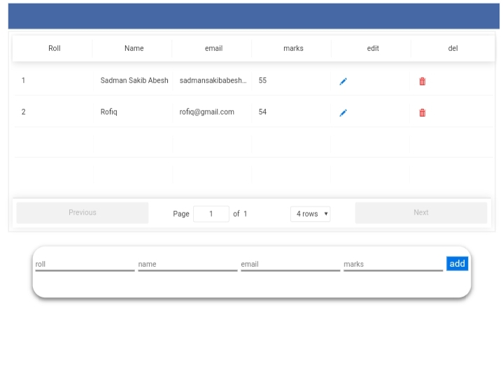

<h3>requirements</h3>

install nodejs
install react

```bash
$ npm install mongodb
$ npm install cors
$ npm install express
$ npm install body-parser
```

then clone this project

```bash
$ git clone https://github.com/sadman-sakib-abesh/crud_mern_project_result_sheet.git && cd crud_mern_project_result_sheet
```

configure the index.js and create.js then run

```bash
$ npm db
```

it will creat the db and collection in your database. we are using mongodb atlas

then run

```bash
$ npm start
```

in the directory and in ui directoey to start front end


